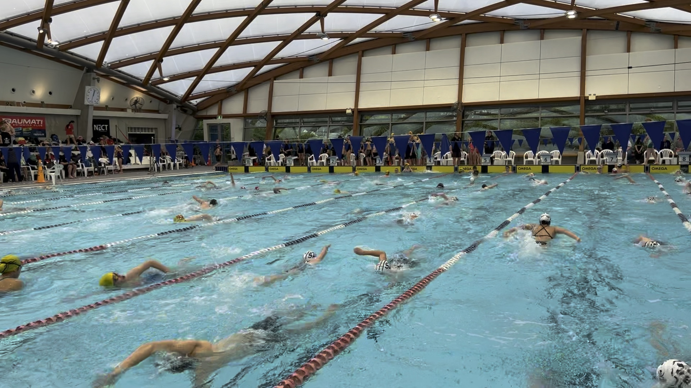
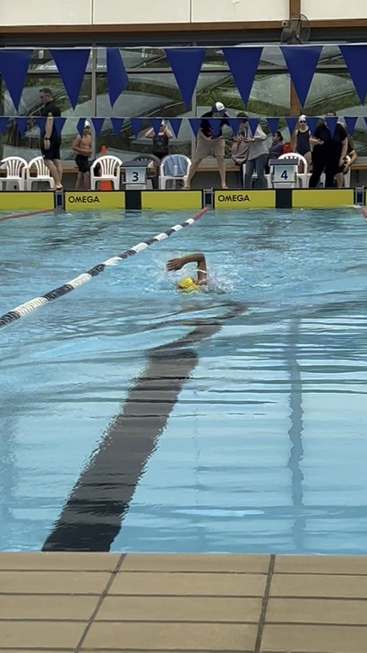
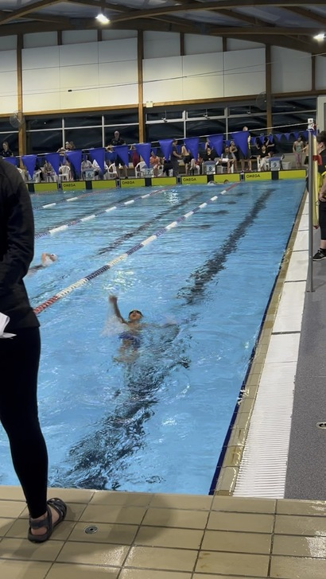
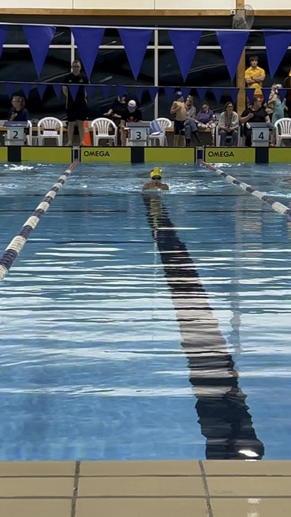

Today, Kavya participated in the Pirates Skull & Dagger NQ meet held at Coastlands Aquatic Centre in Kāpiti. A large number of swimmers from at least seven different swim clubs across the greater Wellington region were present. This was a qualifying meet, meaning you don't receive medals or ribbons, but instead an official time to qualify for other events, such as the upcoming Wellington Junior Championship.

At the meet, Kavya competed in the 50m Freestyle, 50m Backstroke, and 200m Breaststroke. It was exciting to watch Kavya finish the 50m Freestyle in 0:47.65, achieving his personal best to date. He was 4.5 seconds shy of the Wellington Junior Champs qualifying time—next time!

His backstroke wasn't the best yesterday, as he took 2 seconds longer than his personal best to finish.

Finally, he swam his first-ever 200m Breaststroke, finishing in 4:10.44. Although his time was 5 seconds slower than the qualifying time for the Wellington Champs, we're thrilled with what he achieved, especially with only a couple of practices at that distance.

*Note for Kavya: You continue to amaze us with your perseverance, courage, and competitiveness while staying humble. Watching you reach new heights every day fills us with aroha.* :family_man_woman_boy: :heart:

