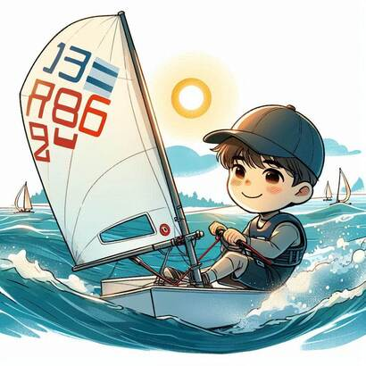

<!--  -->

It was a dark stormy night, thunder boomed in the rain. I ran to my house. Someone was following me. My feet splashed in the muddy puddles as I was running on the street. I noticed a man with a walking stick on the middle of the road that was next to my house. I shouted “Who are you? Where did you come from?” but he did not answer. He just walked away into the darkness. I quickly ran into my house. I was soaking wet. 

When the morning came by I got changed and headed out for work. I got in my car and noticed it was out of fuel. So I called a taxi. I got into the seat next to the driver. I told him impatiently “Take me to The White House!” but he started driving me to a different place. 

He got me to get out of the car and then a hood went over my head. It was pitch black. I got knocked out. I woke up tied to a chair in the darkness. I was alone and scared. I was crying for help. My screams were so loud that if I were in a giant hall the sound waves of my voice would travel throughout the whole hall filling every atom in the room. After waiting for about a minute or so, I saw some people come. 

They switched on the light. Then I figured out that I was on a stage of some theatre there were rows and rows of seats. The theatre was ginormous. The amount of seats were uncountable. I noticed that there was an audience staring at me. I got stage fright, I didn’t know what to say. I was speechless but the worst part is I had been screaming to a bunch of random strangers who thought I was a part of an act! 

The play had taken forever and I was waiting tied to a chair with a bunch of people acting in front of me. Then they tied a head band over my eyes but I could still see faintly but then I was starting to wish I couldn’t, because I saw a knife dripping in front of me. The last sound I hear was a squelch and  felt a slight stomach ache. These words are the last… MY LAST…!
